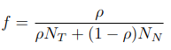

[](https://doi.org/10.5281/zenodo.5565743)
[](https://badge.fury.io/py/vafator)
[](https://anaconda.org/bioconda/vafator)
[](https://github.com/TRON-Bioinformatics/vafator/actions/workflows/unit_tests.yml)
[](https://codecov.io/gh/TRON-Bioinformatics/vafator)
[](https://opensource.org/licenses/MIT)


VAFator annotates the variants in a VCF file with technical annotations extracted from one or more BAM alignment files. 
We implement a set of basic coverage annotations and also more sophisticated published annotations used to assess the 
quality of every variant call.
Any arbitrary number of BAM files from different samples and/or technical replicates can be provided.
The aim of VAFator is to provide these technical annotations with independence of the variant caller and maintaining
a flexible read filtering. 
This allows to scrutinize the results of variant calling in a wide set of use cases, eg: benchmark of variant callers, 
somatic variant calling, tumor evolution with multiple samples at different time points, comparison of replicates.

| Annotation                              | Description                                                                                                                                                                                             | INFO field        | Type  | Cardinality (§) |
|-----------------------------------------|---------------------------------------------------------------------------------------------------------------------------------------------------------------------------------------------------------|-------------------|-------|-----------------|
| Allele frequency (AF)                   | Ratio of reads supporting the alternate allele                                                                                                                                                          | {sample}_af       | float | A               |
| Allele count (AC)                       | Count of reads supporting the alternate allele                                                                                                                                                          | {sample}_ac       | int   | A               |
| Count ambiguous bases (N)               | Count of ambiguous bases (N + all IUPAC ambiguity codes) overlapping the variant                                                                                                                        | {sample}_n        | int   | 1               |
| Depth of coverage (DP)                  | Count of reads covering the position of the variant                                                                                                                                                     | {sample}_dp       | int   | 1               |
| Expected allele frequency               | Expected allele frequency assuming a multiplicity of the mutation m=1 (the number of DNA copies bearing a mutation) considering the given purity and ploidy/copy numbers                                | {sample}_eaf      | float | 1               |
| Probability undetected                  | Probability that a given somatic mutation is undetected given the total coverage, supporting reads and expected allele frequency                                                                        | {sample}_pu       | float | A               |
| Power                                   | Power to detect a somatic mutation given the total coverage and expected allele frequency (Carter, 2012)                                                                                                | {sample}_pw       | float | 1               |
| k                                       | Minimum number of supporting reads such that the probability of observing k or more non-reference reads due to sequencing error is less than the defined false positive rate (FPR) (Carter, 2012)       | {sample}_k        | float | 1               |
| Mapping quality median                  | Median mapping quality of reads supporting each of the reference and the alternate alleles                                                                                                              | {sample}_mq       | float | R               |
| Mapping quality rank sum test (§§)            | Rank sum test comparing the MQ distribution between reads supporting the reference and the alternate. Values closer to zero indicate similar distributions.                                             | {sample}_rsmq     | float | A               |
| Mapping quality rank sum test p-value (§§)   | Significance of the rank sum test comparing the MQ distribution between reads supporting the reference and the alternate. The null hypothesis is that there is no difference in the distributions       | {sample}_rsmq_pv  | float | A               |
| Base call quality median                | Median base call quality of reads supporting each of the reference and the alternate alleles (not available for deletions)                                                                              | {sample}_bq       | float | R               |
| Base call quality rank sum test (§§)        | Rank sum test comparing the BQ distribution between reads supporting the reference and the alternate. Values closer to zero indicate similar distributions                                              | {sample}_rsbq     | float | A               |
| Base call quality rank sum test p-value (§§) | Significance of the rank sum test comparing the BQ distribution between reads supporting the reference and the alternate. The null hypothesis is that there is no difference in the distributions       | {sample}_rsbq_pv  | float | A               |
| Position median                         | Median position within reads supporting each of the reference and the alternate alleles (in indels this is the start position)                                                                          | {sample}_pos      | float | R               |
| Position rank sum test  (§§)                | Rank sum test comparing the position distribution between reads supporting the reference and the alternate. Values closer to zero indicate similar distributions                                        | {sample}_rspos    | float | A               |
| Position rank sum test p-value (§§)         | Significance of the rank sum test comparing the position distribution between reads supporting the reference and the alternate. The null hypothesis is that there is no difference in the distributions | {sample}_rspos_pv | float | A               |

§ cardinality is defined as in the VCF format specification: `A` refers to one value per alternate allele, 
`R` refers to one value per possible allele (including the reference), `1` refers to one value.

§§ rank sum tests require at least one read supporting the reference and one read supporting the alternate


VAFator uses cyvcf2 (Pederson, 2017) to read/write VCF files and pysam (https://github.com/pysam-developers/pysam) to read BAM files.
Both libraries are cython wrappers around HTSlib (Bonfield, 2021).

## How to install

Install from PyPI (`pip install vafator`) or from bioconda (`conda install bioconda::vafator`).

When installaing from PyPI there are some system dependencies that will need to be met: 
* libcurl
* libz
* liblzma
* htslib=1.14

## How to run

Run as follows:
```
vafator --input-vcf /path/yo/your.vcf \
--output-vcf /path/yo/your_vafator.vcf \ 
--bam normal /path/to/your_normal.bam \
--bam primary /path/to/your_primary_tumor.bam \
--bam metastasis /path/to/your_metastasis_tumor.bam
```

This will add annotations for each of the three samples `normal`, `primary` and `metastasis`: `normal_ac`, 
`normal_dp`, `normal_af`, `normal_pw`, `primary_ac`, `primary_dp`, etc.

### Support for indels

VAFator provides equivalent annotations for indels. Depth of coverage and allele frequency are calculated on the
position immediately before the indel. Only insertions and deletions as recorded in the CIGAR matching the respective
coordinates and sequence from the VCF file are taken into account. Any read supporting a similar but not identical indel
is not counted.

**NOTE**: multiallelic mutations are not supported for indels, the indel in the multiallelic position will be
annotated with null values. This problem can be circumvented by using the Nextflow normalization pipeline described above.

### Support for MNVs

Not supported at the moment when not decomposed.

If running the nextflow pipeline indicated above, MNVs and complex variants are by default decomposed and hence
correctly annotated by VAFator.

### Support for technical replicates

If more than one BAM  for the same sample is provided then the annotations are calculated across all BAMs 
and for also each of them separately (eg: `primary_af` provides the allele frequency across all primary tumor BAMs, 
`primary_af_1` and `primary_af_2` provide the allele frequency on the first and second BAM respectively).

```
vafator --input-vcf /path/yo/your.vcf \
--output-vcf /path/yo/your_vafator.vcf \ 
--bam primary /path/to/your_primary_tumor_1.bam \
--bam primary /path/to/your_primary_tumor_2.bam
```

### Read filtering

Use the parameters `--mapping-quality` and `--base-call-quality` to define the minimum quality values for each read.
All reads with quality values below these thresholds will be filtered out. 
The default values are MQ >= 1 and BQ >= 30.

Overlapping reads from read pairs are not double counted. The read with the highest base call quality is chosen.

Reads flagged as duplicates are not counted.


### Power to detect a somatic mutation and probability of an undetected somatic mutation

We estimate the power to detect a somatic mutation given a total coverage (DP), k and expected VAF, 
as described in Carter, 2012.

Where k is the minimum number of supporting reads such that the
probability of observing k or more non-reference reads due to sequencing error is less than the 
defined false positive rate (FPR). 
Default FPR is 5x10^-7 and default error rate is 10^-3.
These values can be changes using `--fpr` and `--error-rate`.

The expected VAF is by default 0.5, making several assumptions: 
1) no normal contamination in tumor sample (default purity: 1.0)
2) ploidy in normal of 2
3) ploidy in tumor of 2
4) the mutation is clonal and the mutation multiplicity is one irrespective of the copy number

Expected VAF (f) is calculated as follows:



The purity in a given tumor sample can be specified with the parameter `--purity primary 0.5`.

The ploidy in the normal sample can be specified as `--normal_ploidy 3`. 
Only one normal sample may be specified.
Also, in the normal only genome-wide ploidy may be specified.

The ploidy in a given tumor sample can be specified either as a genome-wide value `--tumor-ploidy metastasis 4`
or local copy numbers in a BED file as follows `--tumor-ploidy metastasis /path/to/copy_numbers.bed`.

The expected format of the BedGraph file ([specification](https://genome.ucsc.edu/goldenpath/help/bedgraph.html)) 
without any track information as indicated below:
```
chr1    10000   20000   3.2
chr1    20000   30000   2.6
[...]
```

Also, we estimate the probability that there is an undetected somatic mutation at a specific genomic location, given:
- n: observed number of reads at the position (DP)
- ac: observed number of reads supporting the mutation (AC
- f: expected variant allele frequency (VAF)

We model this with a binomial distribution `binom(n, f, ac)`.


**NOTE**: beware that unlike VCF files where genomic positions are 1-based, BedGraph positions are 0-based. The intervals
in a BED file are half-closed.

**NOTE 2**: local copy numbers may be float numbers

**NOTE 3**: beware that no multiple test correction is applied to the probability and power calculations

In order to integrate Hatchet copy numbers were multiple clones are considered, there is a specific 
command `hatchet2bed` that transforms a Hatchet .ucn output file into one BedGraph file as described above per sample.
The Hatchet reported clone copy numbers are averaged by the relative abundance of each clone. 

Run this as follows:
```
hatchet2bed --input-file your.hatchet.ucn --output-prefix your_beds_prefix
```

The Hatchet file expects the following columns, where any number of clones is supported:
```
#CHR	START	END	SAMPLE	cn_normal	u_normal	cn_clone1	u_clone1	cn_clone2	u_clone2	cn_clone3	u_clone3	cn_clone4	u_clone4
```

### Rank sum tests

We apply the Wilcoxon rank sum test between the reference and alternate distributions of mapping qualities, 
base call qualities and position within the read. A mutation call were any of these three tests show a significant 
difference between the reference and alternate reads may indicate a lower quality variant call.
This follows the approach introduced by GATK (DePristo et al., 2011).

For each of the checked distributions we provide the statistic value of the rank sum test and its significance.
The statistic value will be close to zero for similar distributions and further away from zero for dissimilar distributions.
The significance value corresponds to the null hypothesis of similar distributions. 
No multiple test correction is applied over this p-value.

### Ambiguous bases

Some reads may contain ambiguous bases with high base call quality scores.
The count of all reads passing the quality thresholds that contain an
ambiguous base overlapping the mutation are annotated.
All IUPAC ambiguity codes are taken into account.

Also, these reads supporting ambiguous bases are not taken into account in the depth of coverage (DP)
as they may dilute the VAF values. In order to include those into the depth of coverage use the flag
`--include-ambiguous-bases`. Only SNVs are supported.

## Understanding the output

The output is a VCF with the some new annotations in the INFO field for the provided sample names.
The example below contains vafator annotations for two samples named `normal` and `tumor`.
```
chr1    12345       .       A       G       .       PASS  tumor_af=0.0;tumor_ac=0;tumor_dp=89;tumor_mq=60.0,0.0;tumor_bq=32.0,0.0;tumor_pos=50.0,0.0;tumor_pw=0.75;tumor_eaf=0.5;normal_af=0.0196;normal_ac=1;normal_dp=51;normal_mq=60.0,10.0;tumor_bq=32.0,40.0;tumor_pos=50.0,10.0;tumor_pw=0.005;normal_eaf=0.5
chr2    12345       .       A       G,T       .       PASS  tumor_af=0.2,0.2;tumor_ac=2,2;tumor_dp=10;tumor_mq=60.0,30.0,30.0;tumor_bq=32.0,45.0,30.0;tumor_pos=50.0,20.0,32.0;tumor_pw=0.65;tumor_eaf=0.5;normal_af=0.0,0.0;normal_ac=0,0;normal_dp=10;normal_mq=60.0,30.0,30.0;normal_bq=32.0,45.0,30.0;normal_pos=50.0,20.0,32.0;normal_pw=0.65;normal_eaf=0.5
```

**NOTE**: notice that VAFator does not annotate samples in the FORMAT field, but in the INFO field

## Filter for multi-allelic variants

Multi-allelic variants are those that have more than one alternative allele (e.g.: A>C,G).
This tool allows to select the allele with the highest allele frequency and filter out the lower frequency allele.

Run as follows:
```
multiallelics-filter --input-vcf /path/to/your_vafator.vcf \
--output-vcf /path/to/your_vafator_filtered.vcf \
--tumor-sample-name <SAMPLE> 
```

The above will look for the annotation `<SAMPLE>_af` and for multi-allelic variants it will filter out those with lower 
frequencies. Beware, that if the multi-allelic variants are split into more than one line in the VCF nothing will be 
filtered out.

## Run as a Nextflow pipeline

VAFator is available as a Nextflow pipeline for convenience.

Run as follows:
```
nextflow run tron-bioinformatics/tronflow-vcf-postprocessing -r 2.2.0 -profile conda ...
```

See https://github.com/TRON-Bioinformatics/tronflow-vcf-postprocessing for more details


## Bibliography

- Pedersen, B. S., & Quinlan, A. R. (2017). cyvcf2: fast, flexible variant analysis with Python. Bioinformatics, 33(12), 1867–1869. https://doi.org/10.1093/BIOINFORMATICS/BTX057
- Bonfield, J. K., Marshall, J., Danecek, P., Li, H., Ohan, V., Whitwham, A., Keane, T., & Davies, R. M. (2021). HTSlib: C library for reading/writing high-throughput sequencing data. GigaScience, 10(2). https://doi.org/10.1093/GIGASCIENCE/GIAB007
- Carter, S. L., Cibulskis, K., Helman, E., McKenna, A., Shen, H., Zack, T., Laird, P. W., Onofrio, R. C., Winckler, W., Weir, B. A., Beroukhim, R., Pellman, D., Levine, D. A., Lander, E. S., Meyerson, M., & Getz, G. (2012). Absolute quantification of somatic DNA alterations in human cancer. Nature Biotechnology 2012 30:5, 30(5), 413–421. https://doi.org/10.1038/nbt.2203
- DePristo M, Banks E, Poplin R, Garimella K, Maguire J, Hartl C, Philippakis A, del Angel G, Rivas MA, Hanna M, McKenna A, Fennell T, Kernytsky A, Sivachenko A, Cibulskis K, Gabriel S, Altshuler D, Daly M. (2011). A framework for variation discovery and genotyping using next-generation DNA sequencing data. Nat Genet, 43:491-498. DOI: 10.1038/ng.806.

